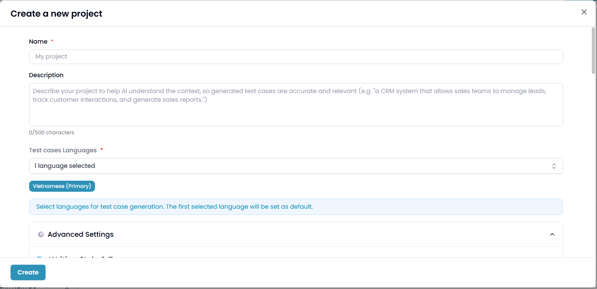
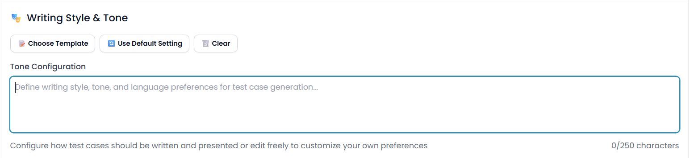
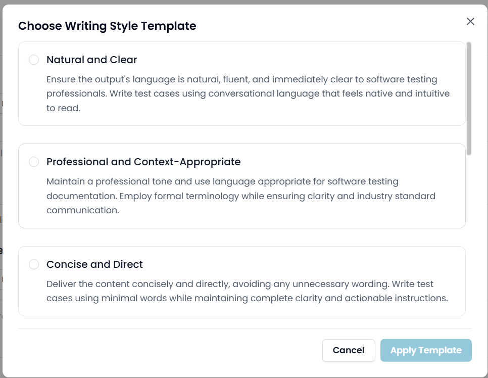
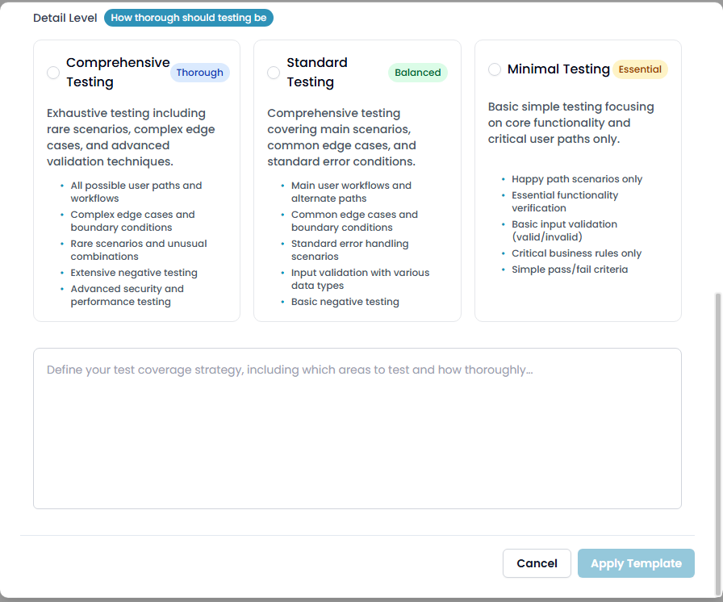
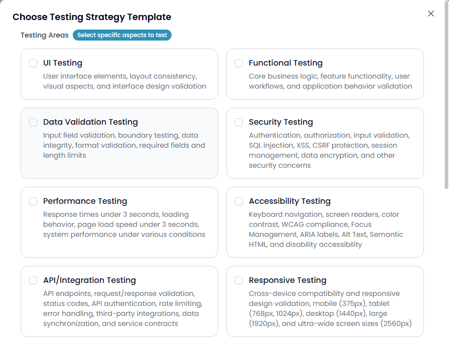
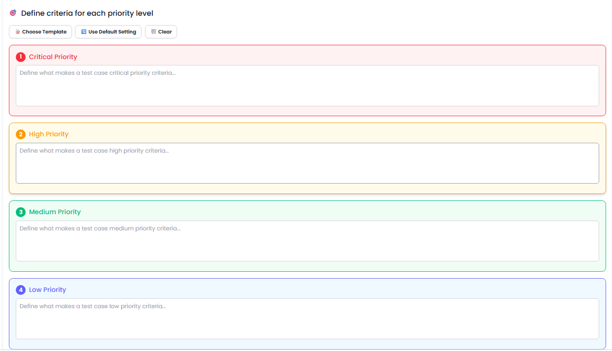
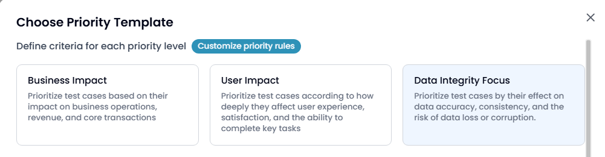

# 📑 UI Specification – Project Creation & Settings

## A. Project & Setting

### A.1. Name
- **Loại input**: Text input
- **Mô tả**: Nhập tên project (bắt buộc)

### A.2. Description
- **Loại input**: Text area
- **Mô tả**: Nhập mô tả project, tối đa 500 ký tự

### A.3. Test Cases Languages
- **Loại input**: Select-box (multi-select)
- **Tùy chọn**: Vietnamese, English, Chinese, Japanese, French…
- **Mô tả**: Chọn ngôn ngữ dùng cho test case

📷 *Ảnh minh họa*: 

---

### A.4. Writing Style & Tone
- **Loại input**: Text area (có thể nhập trực tiếp)
- **Chức năng**:
  - **Choose Template**: mở modal chọn template (Natural and Clear, Professional and Context-Appropriate, Concise and Direct). Khi chọn, nội dung sẽ tự động điền vào text area.
  - **Use Default Setting**: chọn option mặc định theo cấu hình sẵn có.
  - **Clear**: xóa toàn bộ nội dung đã nhập.

📷 *Ảnh minh họa*:   

---

### A.5. Checklist Setting – Detail Level
- **Loại input**: Text area + các button (tương tự A4)
- **Modal chọn template**: 3 tùy chọn
  - **Comprehensive Testing (Thorough)** – toàn diện, bao gồm edge cases và negative testing
  - **Standard Testing (Balanced)** – kiểm thử kịch bản chính và edge cases phổ biến
  - **Minimal Testing (Essential)** – chỉ tập trung core functionality và critical paths

📷 *Ảnh minh họa*: 

---

### A.6. Testing Type
- **Loại input**: Checkbox list (hiển thị trực tiếp, không cần modal, không có text area)
- **Tùy chọn**:
  - UI Testing
  - Functional Testing
  - Data Validation Testing
  - Security Testing
  - Performance Testing
  - Accessibility Testing
  - API/Integration Testing
  - Responsive Testing

📷 *Ảnh minh họa*: 

---

### A.7. Priority Levels
- **UI**: hiển thị 4 khối text area để user nhập tiêu chí:
  1. Critical Priority (đỏ)
  2. High Priority (cam)
  3. Medium Priority (xanh lá)
  4. Low Priority (xanh dương)
- **Chức năng**:
  - **Choose Template**: mở modal chọn 1 trong 3 impact type (Business Impact, User Impact, Data Integrity Focus)
  - **Use Default Setting**: điền nội dung mặc định
  - **Clear**: xóa nội dung

📷 *Ảnh minh họa*:   

---

### A.8. Exclusion Rules
- **Loại input**: Checkbox list (multi-select)
- **Tùy chọn**:
  1. Skip Common UI Sections
  2. Skip Non-functional Areas
  3. Skip Third-party Integrations
  4. Skip Redundant Test Cases
  5. Skip Obvious Actions
  6. Skip Minor Visual Issues

---

### A.9. Test Steps Detail Level
- **Loại input**: Radio button (chọn 1 trong 3)
- **Tùy chọn**:
  1. **Low Detail** – chỉ tóm tắt key actions & results, bỏ qua routine steps
  2. **Medium Detail** – gom nhóm bước khi có thể, tập trung main actions & outcomes, kèm test data chính
  3. **High Detail** – chi tiết từng action & expected result, step-by-step, đầy đủ test data

---

## Kết luận
Phần **Project & Setting (A1 → A9)** đã bao quát toàn bộ UI và chức năng cần thiết để khởi tạo và cấu hình một project. Các bước đều có ảnh minh họa đính kèm để tham khảo.
